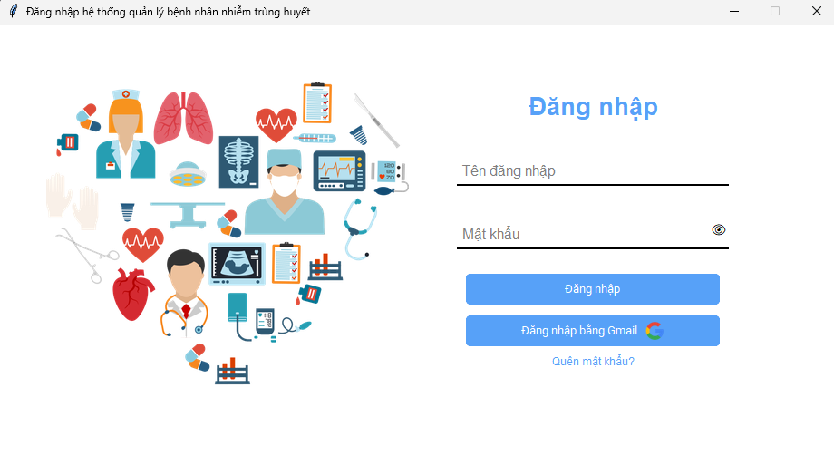

<h1 align="center" style="padding-top:10px;">Sepsis-Application<h1>
<h2 align="left">About the project : <h2>

<h3>Sepsis software is a tool that assists doctors and healthcare professionals in managing patient records, staff records, and login accounts for the software. It also measures health parameters to provide conclusions related to sepsis.</h3>
<h3>Currently, the software is in the process of development and construction. In the future, we will integrate AI into the system and optimize the software to make it even better.</h3>
<h2>Build with :</h2>
<ul>
    <li>
        
    </li>
    <li>
        
    </li>
</ul>
<h2>Getting Started: </h2>
<h2>Contact :</h2>
<ul>
    <li>duongthienanh1902@gmail.com</li>
</ul>